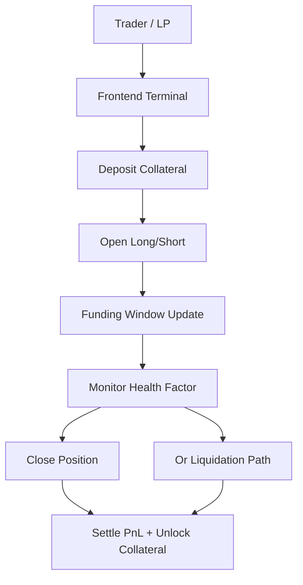
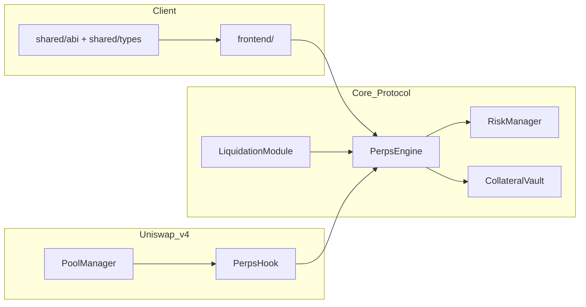
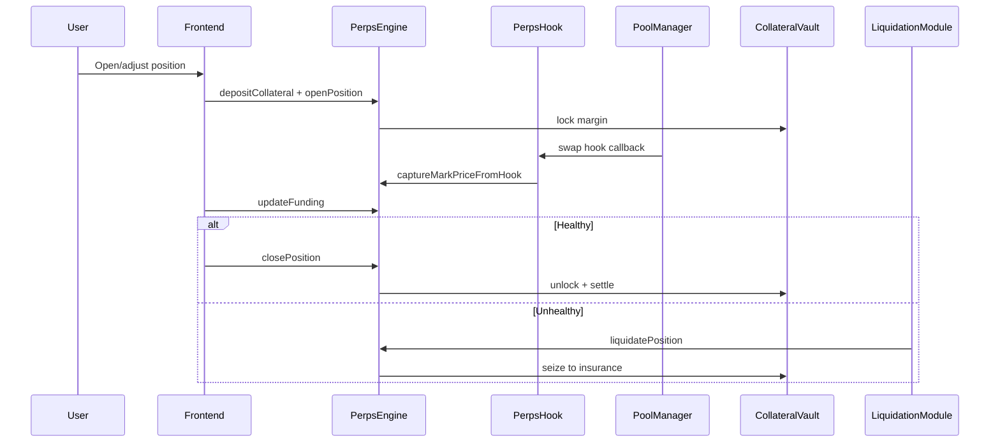

# Unichain Perps on Uniswap v4

[](https://github.com/blue-benz/Unichain-Perps-on-Uniswap-v4/actions/workflows/test.yml)
[](https://soliditylang.org/)
[](https://book.getfoundry.sh/)
[](https://www.unichain.org/)
[](https://docs.uniswap.org/contracts/v4/overview)
[](./LICENSE)

<p>
  
  
  
</p>

Unichain Perps is a hook-integrated perpetual futures protocol on top of Uniswap v4 primitives. It gives traders long/short exposure and gives LPs a native hedge path (especially short perps) without leaving AMM-native rails.

## Problem
- LPs and active traders need deterministic on-chain hedging and short exposure.
- Most perp designs require separate liquidity and fragmented risk accounting.
- Hedging flows are often not tightly coupled to AMM state changes.

## Solution
- Perp mark pricing is captured from Uniswap v4 hook flow.
- Funding accrues in deterministic windows.
- Margin, liquidation, and bad-debt pathways are handled by explicit core modules.
- Demo scripts run full lifecycle flows locally and on Unichain targets.

## Integrations
| Integration | Status | Notes |
| --- | --- | --- |
| Uniswap v4 Hooks | Active | `beforeSwap`/`afterSwap` mark capture path |
| Unichain | Active | Primary deployment target for prize track |
| Reactive Network | Optional/Planned | Event-driven automation path can be layered later |

## Major Components
- `PerpsHook`: Uniswap v4 hook entrypoints and mark capture.
- `PerpsEngine`: positions, collateral accounting, funding accrual, pnl settlement.
- `RiskManager`: IMR/MMR checks, max leverage bounds, liquidation thresholds.
- `LiquidationModule`: liquidation executor and insurance handoff.
- `CollateralVault`: collateral custody, lock/unlock, insurance bucket.
- `frontend/`: perps terminal for open/close, margin ops, liquidation monitor, hedge story.
- `shared/`: shared ABIs and types for frontend + scripts.

## Diagrams and Flowcharts
### User Perspective Flow


### Architecture Flow (Subgraph)


### Perp Lifecycle Sequence


## Deployed Addresses and TxIDs
### Latest Local Demo Deployment (Anvil, chainId 31337)
| Component | Address | Deployment TxID | Tx URL |
| --- | --- | --- | --- |
| RiskManager | `0xdbC43Ba45381e02825b14322cDdd15eC4B3164E6` | `0x9fd2352c28b132fd603c1445c807b80b6ee6ddf7424655a1bf2a4fef3c89579a` | `N/A (Anvil local)` |
| CollateralVault | `0x04C89607413713Ec9775E14b954286519d836FEf` | `0xc2ac95bbab798d83fc18bcecfd650d9a2357c68cd802a2ee355736fb1500b6c1` | `N/A (Anvil local)` |
| PerpsEngine | `0x4C4a2f8c81640e47606d3fd77B353E87Ba015584` | `0x4e336f1eb20277bc92f2cfaed2cff1c53b0c9816f9c9a3e86df9271c78936615` | `N/A (Anvil local)` |
| PerpsHook | `0x633a129697c2161D77e44092De0c39a6530280c0` | `0x1dcea8e60f84286fd950e541e1accd5d4ae25713c43a268ada5668164e88be4c` | `N/A (Anvil local)` |
| LiquidationModule | `0x21Df544947ba3E8b3c32561399E88B52DC8B2823` | `0xa6afa2b89d963282987271b3c2fab230ef79432735b1f9436af392440ca02e0f` | `N/A (Anvil local)` |

### Unichain Deployment
| Component | Address | Deployment TxID | Tx URL |
| --- | --- | --- | --- |
| RiskManager | `TBD` | `TBD` | `TBD (Unichain explorer URL)` |
| CollateralVault | `TBD` | `TBD` | `TBD (Unichain explorer URL)` |
| PerpsEngine | `TBD` | `TBD` | `TBD (Unichain explorer URL)` |
| PerpsHook | `TBD` | `TBD` | `TBD (Unichain explorer URL)` |
| LiquidationModule | `TBD` | `TBD` | `TBD (Unichain explorer URL)` |

## Demo Run (Lifecycle Script + TxIDs)
- Script: `script/20_DemoLifecycle.s.sol:DemoLifecycleScript`
- Broadcast artifact: `broadcast/20_DemoLifecycle.s.sol/31337/run-latest.json`
- Demo status: `ONCHAIN EXECUTION COMPLETE & SUCCESSFUL`

Key lifecycle txids from latest local demo:
- Open long/short path txids include `0x344f599cf191781719aac7f43fa0c345dadfc0d81414d8e99c1f8fcef63515e7` and `0x04648e1b7d468a8dd700bbbd04cf166d5c2884a2791164d77b7a916487ca7b03`
- Funding update txid: `0x79dfb572f88dd590a918e358b043c74602ad4679a2d44e3c03a4b754c56de738`
- Liquidation txid: `0xc3361b3eb9a740da6f2d03985df779b920b6ac1840c290d9456992d7bebf665e`
- Tx URLs: `N/A (Anvil local)`

## Run Commands
```bash
# install deps and pin uniswap v4 refs
make bootstrap

# unit + fuzz + integration tests
make test

# local lifecycle demo (anvil)
make demo-local

# unichain deploy + demo
make deploy-unichain
make demo-unichain
```

Direct script mode:
```bash
DEPLOYER_PRIVATE_KEY=... \
TRADER_A_PRIVATE_KEY=... \
TRADER_B_PRIVATE_KEY=... \
LOCAL_RPC_URL=http://127.0.0.1:8545 \
./scripts/demo_local.sh
```

## Testing and Coverage Proof
- 100% test pass rate on current suite: `17/17 passing`.
- Coverage command used:
```bash
FOUNDRY_PROFILE=coverage forge coverage --report summary
```
- Current coverage totals from latest run:
  - Lines: `78.49% (438/558)`
  - Statements: `72.30% (488/675)`
  - Branches: `32.76% (38/116)`
  - Functions: `84.71% (72/85)`

Test categories in this repo:
- Unit tests: `test/PerpsEngine.t.sol`
- Fuzz tests: `test/fuzz/PerpsEngine.Fuzz.t.sol`
- Integration tests: `test/integration/PerpsHookIntegration.t.sol`
- Utility/library tests: `test/utils/libraries/EasyPosm.t.sol`

## Future Roadmap
- Push core-contract coverage toward full branch coverage and 100% lines/functions.
- Add isolated/cross margin mode switch with stricter risk buckets.
- Add configurable index adapters with strict fallback and circuit breakers.
- Add richer LP hedge dashboard analytics (hedged vs unhedged pnl curves).
- Publish finalized Unichain mainnet deployment table with explorer-linked txids.

## Documentation Index
- [Overview](./docs/overview.md)
- [Architecture](./docs/architecture.md)
- [Perps Model](./docs/perps-model.md)
- [Risk Engine](./docs/risk-engine.md)
- [Security](./docs/security.md)
- [Deployment](./docs/deployment.md)
- [Demo](./docs/demo.md)
- [API](./docs/api.md)
- [Testing](./docs/testing.md)
- [Frontend](./docs/frontend.md)

## Security
See [SECURITY.md](./SECURITY.md).
