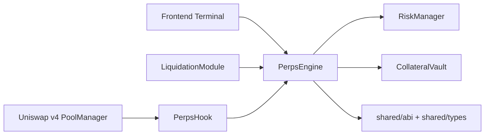
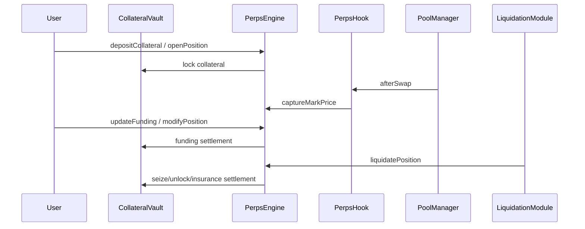
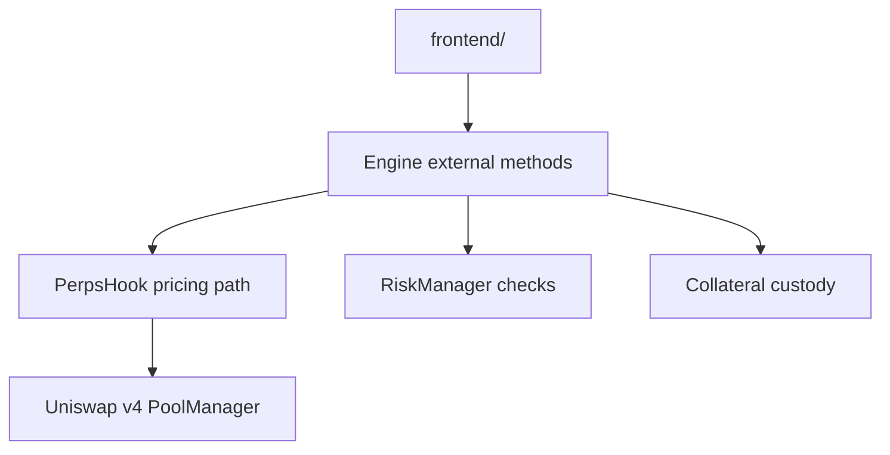

# Unichain Perps on Uniswap v4

<p>
  
  
  
</p>

Hook-integrated perpetual futures protocol for Unichain, built as a Uniswap v4-native derivatives primitive for trader execution and LP hedging.

## Problem
Uniswap LPs and active traders need deterministic on-chain short exposure without leaving AMM-native liquidity rails.

## Solution
- Mark-price capture from Uniswap v4 pool state through hook callbacks.
- Isolated-margin perp engine with deterministic funding windows.
- Explicit risk engine and liquidation module.
- Judge-ready local + Unichain deployment/demo scripts.

## Architecture


## Perp lifecycle


## Component interaction


## Repository layout
```text
.github/workflows/
.vscode/
assets/
context/
docs/
frontend/
lib/
script/
scripts/
src/
test/
shared/
```

## Contracts
- `src/PerpsHook.sol`
- `src/PerpsEngine.sol`
- `src/RiskManager.sol`
- `src/LiquidationModule.sol`
- `src/CollateralVault.sol`

## Dependency pinning
Bootstrap enforces v4-periphery commit pin:
- `3779387e5d296f39df543d23524b050f89a62917`

Run:
```bash
make bootstrap
```

## Quickstart
```bash
cp .env.example .env
make bootstrap
make test
npm install
npm run frontend:build
```

## Demo commands
```bash
make demo-local
make demo-unichain
make demo-hedge
```

## Unichain deployment
```bash
source .env
make deploy-unichain
```

Required env:
- `UNICHAIN_RPC_URL`
- `PRIVATE_KEY`

## Unichain addresses
Fill after broadcast.

- `PerpsEngine`: `TBD`
- `PerpsHook`: `TBD`
- `CollateralVault`: `TBD`
- `RiskManager`: `TBD`
- `LiquidationModule`: `TBD`
- Explorer links: `TBD (chain-specific)`

When explorer base URL is unavailable, scripts print raw tx hashes.

## Hedge narrative (judge story)
1. LP provides liquidity in v4 pool.
2. Market move creates directional LP exposure.
3. LP opens short perp to offset delta.
4. Compare unhedged vs hedged drawdown in frontend panel.

## Documentation index
- [Overview](./docs/overview.md)
- [Architecture](./docs/architecture.md)
- [Perps Model](./docs/perps-model.md)
- [Risk Engine](./docs/risk-engine.md)
- [Security](./docs/security.md)
- [Deployment](./docs/deployment.md)
- [Demo](./docs/demo.md)
- [API](./docs/api.md)
- [Testing](./docs/testing.md)
- [Frontend](./docs/frontend.md)

## Security
See [SECURITY.md](./SECURITY.md).
