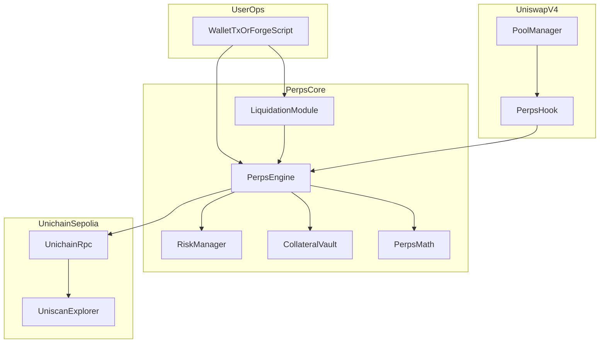
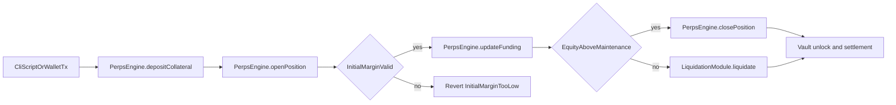
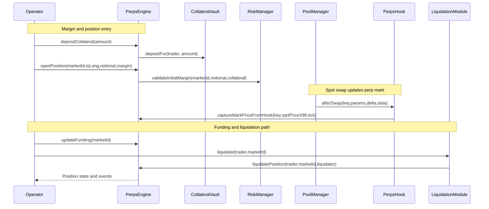

# Unichain Perps on Uniswap v4
**Built on Uniswap v4 · Deployed on Unichain Sepolia**  
_Targeting: Uniswap Foundation Prize · Unichain Prize_

> A hook-integrated perpetual futures protocol that keeps pricing, funding, margin, and liquidation fully on-chain using Uniswap v4 pool state on Unichain.

[](https://github.com/blue-benz/Unichain-Perps-on-Uniswap-v4/actions/workflows/test.yml)
[](https://github.com/blue-benz/Unichain-Perps-on-Uniswap-v4/blob/main/scripts/verify_coverage.sh)
[](https://soliditylang.org/)
[](https://docs.uniswap.org/contracts/v4/overview)
[-0ea5e9)](https://sepolia.uniscan.xyz/)

## The Problem
LPs and active traders can hedge, but most paths split execution across independent systems. That creates stale marks, inconsistent margin checks, and non-deterministic liquidation timing.

| Layer | Failure Mode |
| --- | --- |
| Pricing | Mark updates lag the venue where users hedge |
| Margin | Collateral checks differ between entry and liquidation |
| Funding | Funding updates are discretionary and hard to audit |
| Liquidation | Healthy/unhealthy boundaries are inconsistently enforced |

When these failures combine, users absorb avoidable losses and protocols absorb avoidable bad debt.

## The Solution
The protocol uses Uniswap v4 hook callbacks as deterministic market-state inputs and keeps all perps accounting on-chain.

1. A Uniswap v4 pool swap triggers `PerpsHook` callback execution.
2. `PerpsHook.afterSwap` reads `slot0` and forwards `(sqrtPriceX96, tick)` to `PerpsEngine.captureMarkPriceFromHook`.
3. `PerpsEngine` stores market mark price and updates funding in discrete windows.
4. Traders deposit collateral and open/modify/close positions through `PerpsEngine`.
5. `RiskManager` enforces IMR, MMR, leverage limits, and funding premium clamp.
6. `LiquidationModule` calls `PerpsEngine.liquidatePosition` when equity falls below maintenance.
7. `CollateralVault` accounts free balance, locked balance, and insurance balance for settlement flows.

Core insight: the same pool event stream that moves spot liquidity can deterministically anchor perp risk transitions.

## Architecture

### Component Overview
```text
src/
  PerpsHook.sol            - beforeSwap/afterSwap hook; mark capture + swap guardrails.
  PerpsEngine.sol          - positions, funding accrual, pnl, margin, liquidation state.
  RiskManager.sol          - IMR/MMR/leverage/premium clamp parameters and checks.
  CollateralVault.sol      - custody for free collateral, locked collateral, insurance.
  LiquidationModule.sol    - external liquidation entrypoint for keeper actors.
  libraries/PerpsMath.sol  - fixed-point conversions and signed perps math helpers.
```

### Architecture Flow (Subgraphs)


### User Perspective Flow


### Interaction Sequence


## Perps Risk Lifecycle
| Stage | Entry Condition | Primary Functions | Exit Condition |
| --- | --- | --- | --- |
| Collateralized | User has free balance | `depositCollateral`, `withdrawCollateral` | Margin moved to position |
| Open Position | `sizeUsdX18 != 0` | `openPosition`, `modifyPosition`, `closePosition` | Size reduced to zero or liquidated |
| Funding Active | Funding window elapsed | `updateFunding`, funding settlement on user actions | `lastFundingTimestamp` advances |
| Maintenance Watch | Equity near MMR | `removeMargin`, `_validateMaintenance` path | Healthy close or liquidation |
| Liquidated | Equity < MMR | `liquidate` -> `liquidatePosition` | Position reset, insurance/bad debt updated |

Funding is settled lazily on user-touching state transitions, so historical funding remains deterministic without keeper-only dependencies.

## Deployed Contracts

### Unichain Sepolia (chainId 1301)
| Contract | Address |
| --- | --- |
| PoolManager | [0x00b036b58a818b1bc34d502d3fe730db729e62ac](https://sepolia.uniscan.xyz/address/0x00b036b58a818b1bc34d502d3fe730db729e62ac) |
| PositionManager | [0xf969aee60879c54baaed9f3ed26147db216fd664](https://sepolia.uniscan.xyz/address/0xf969aee60879c54baaed9f3ed26147db216fd664) |
| Quoter | [0x56dcd40a3f2d466f48e7f48bdbe5cc9b92ae4472](https://sepolia.uniscan.xyz/address/0x56dcd40a3f2d466f48e7f48bdbe5cc9b92ae4472) |
| StateView | [0xc199f1072a74d4e905aba1a84d9a45e2546b6222](https://sepolia.uniscan.xyz/address/0xc199f1072a74d4e905aba1a84d9a45e2546b6222) |
| UniversalRouter | [0xf70536b3bcc1bd1a972dc186a2cf84cc6da6be5d](https://sepolia.uniscan.xyz/address/0xf70536b3bcc1bd1a972dc186a2cf84cc6da6be5d) |
| CollateralToken (MockERC20) | [0xe78663b6b31a67223f2a23e638142d5916484491](https://sepolia.uniscan.xyz/address/0xe78663b6b31a67223f2a23e638142d5916484491) |
| Pool Currency0 (MockERC20) | [0xbdeea35f47e305791080c74b2551a521c406b7a2](https://sepolia.uniscan.xyz/address/0xbdeea35f47e305791080c74b2551a521c406b7a2) |
| Pool Currency1 (MockERC20) | [0xcc84e73f16f0c52f49130ee39e379b4497fa6299](https://sepolia.uniscan.xyz/address/0xcc84e73f16f0c52f49130ee39e379b4497fa6299) |
| RiskManager | [0x1c47706ad9527ea45feb940e0c1f14d54f103abc](https://sepolia.uniscan.xyz/address/0x1c47706ad9527ea45feb940e0c1f14d54f103abc) |
| CollateralVault | [0xee661645166fbd92e712ecbcf786b9c1707997ef](https://sepolia.uniscan.xyz/address/0xee661645166fbd92e712ecbcf786b9c1707997ef) |
| PerpsEngine | [0xac25bd28d5171821ecc9030933778d2ce242fa8a](https://sepolia.uniscan.xyz/address/0xac25bd28d5171821ecc9030933778d2ce242fa8a) |
| PerpsHook | [0x1ffcdc8fddfdf5b171ed90af03b498e0c1c6c0c0](https://sepolia.uniscan.xyz/address/0x1ffcdc8fddfdf5b171ed90af03b498e0c1c6c0c0) |
| LiquidationModule | [0x0d428e4ee3da759831bdbf0e75aecf91dda24764](https://sepolia.uniscan.xyz/address/0x0d428e4ee3da759831bdbf0e75aecf91dda24764) |

## Live Demo Evidence

Demo run date: **2026-03-10 13:44:40 UTC**  
Artifact: `broadcast/20_DemoLifecycle.s.sol/1301/run-latest.json`

### Phase 1 - Collateral and Insurance Setup (Unichain Sepolia, chainId 1301)
| Action | Tx Hash (Full) | Tx URL (Full) |
| --- | --- | --- |
| Mint deployer collateral | `0x702d860da4e919657d44266aac0a6c2904b1f890b05d98c61d767cc4b155abd5` | https://sepolia.uniscan.xyz/tx/0x702d860da4e919657d44266aac0a6c2904b1f890b05d98c61d767cc4b155abd5 |
| Approve vault for deployer collateral | `0xfb66edd0f00f3b4d7852802e40934e8157082c2cc6040292d1ba02b6cac1a701` | https://sepolia.uniscan.xyz/tx/0xfb66edd0f00f3b4d7852802e40934e8157082c2cc6040292d1ba02b6cac1a701 |
| Deposit insurance to vault | `0xd0f6cb920c6e1f966ef431f893811505d33765b1bd1f082d75350590930ef49b` | https://sepolia.uniscan.xyz/tx/0xd0f6cb920c6e1f966ef431f893811505d33765b1bd1f082d75350590930ef49b |
| Mint Trader A collateral | `0xdd07d8665a995bd41f3421640291d5833ccd6d2a58f31f33ce5071874395c48d` | https://sepolia.uniscan.xyz/tx/0xdd07d8665a995bd41f3421640291d5833ccd6d2a58f31f33ce5071874395c48d |
| Mint Trader B collateral | `0x6c73939e3f99e18274d147377e5064bc7c1fa8cc81e01f13620ef2722fb6c099` | https://sepolia.uniscan.xyz/tx/0x6c73939e3f99e18274d147377e5064bc7c1fa8cc81e01f13620ef2722fb6c099 |

### Phase 2 - Mark/Index Normalization (Unichain Sepolia, chainId 1301)
| Action | Tx Hash (Full) | Tx URL (Full) |
| --- | --- | --- |
| Set temporary hook reporter | `0x32c579208269d4bcb222c5f73d08d0df0a113113c57358a8dc54021259eca7b0` | https://sepolia.uniscan.xyz/tx/0x32c579208269d4bcb222c5f73d08d0df0a113113c57358a8dc54021259eca7b0 |
| Capture baseline mark | `0xda2cfd7dfc924ad48f418d3b68d57d08d42e8c8dcf497d110d42027443762440` | https://sepolia.uniscan.xyz/tx/0xda2cfd7dfc924ad48f418d3b68d57d08d42e8c8dcf497d110d42027443762440 |
| Set baseline index | `0x081ce1d31cdff0430db3109c6772fbd7bb03a1d09a0bfa12055ec29ec2bab785` | https://sepolia.uniscan.xyz/tx/0x081ce1d31cdff0430db3109c6772fbd7bb03a1d09a0bfa12055ec29ec2bab785 |

### Phase 3 - Open Long and Short (Unichain Sepolia, chainId 1301)
| Action | Tx Hash (Full) | Tx URL (Full) |
| --- | --- | --- |
| Trader A approve vault | `0xf0bebcdae7a10987b72866a4589fbd2b11fa03e82eaa2791937d16d049830220` | https://sepolia.uniscan.xyz/tx/0xf0bebcdae7a10987b72866a4589fbd2b11fa03e82eaa2791937d16d049830220 |
| Trader A deposit collateral | `0x3d892dcfa180ae2a9743e829fbe76f2105d675b4a72453e386ad5f3f6307f965` | https://sepolia.uniscan.xyz/tx/0x3d892dcfa180ae2a9743e829fbe76f2105d675b4a72453e386ad5f3f6307f965 |
| Trader A open long | `0x300826b5629f7e5a92e167440314c7e5266b6c81b6face99ea6c48c1c3672afb` | https://sepolia.uniscan.xyz/tx/0x300826b5629f7e5a92e167440314c7e5266b6c81b6face99ea6c48c1c3672afb |
| Trader B approve vault | `0xf1678979ea6b7f842199755018135918124505aa3cfbff6ac219ce07a6c148e1` | https://sepolia.uniscan.xyz/tx/0xf1678979ea6b7f842199755018135918124505aa3cfbff6ac219ce07a6c148e1 |
| Trader B deposit collateral | `0xb5d61d2995367632ee5c9cbdb251c2e2505aed581b8255a71d045147ebadfb2f` | https://sepolia.uniscan.xyz/tx/0xb5d61d2995367632ee5c9cbdb251c2e2505aed581b8255a71d045147ebadfb2f |
| Trader B open short | `0x8487ac23701aaa1cd84a3bffb3876200d72dcc4aa8abd6d76e1219005b0a7fd8` | https://sepolia.uniscan.xyz/tx/0x8487ac23701aaa1cd84a3bffb3876200d72dcc4aa8abd6d76e1219005b0a7fd8 |

### Phase 4 - Adverse Move, Funding, Liquidation (Unichain Sepolia, chainId 1301)
| Action | Tx Hash (Full) | Tx URL (Full) |
| --- | --- | --- |
| Reset index anchor | `0x9b0f651942da0b004509c7463e638e1af4eb12a494e4fee723f1d51b1f7afe47` | https://sepolia.uniscan.xyz/tx/0x9b0f651942da0b004509c7463e638e1af4eb12a494e4fee723f1d51b1f7afe47 |
| Reconfigure hook reporter | `0xec5a273d851fef281634ce27fae986f4d3c62b50899c2cd43ccdfc704e350fd1` | https://sepolia.uniscan.xyz/tx/0xec5a273d851fef281634ce27fae986f4d3c62b50899c2cd43ccdfc704e350fd1 |
| Capture adverse mark | `0x2d8945f0220850556f3e724835a1d3ebd808b3665ffb55a5aeb2a15b02768ccd` | https://sepolia.uniscan.xyz/tx/0x2d8945f0220850556f3e724835a1d3ebd808b3665ffb55a5aeb2a15b02768ccd |
| Apply funding update | `0xcda251d1fc24804d1c49fd972eb2fa9efb929d2072a929705bdfd7a3184a2f89` | https://sepolia.uniscan.xyz/tx/0xcda251d1fc24804d1c49fd972eb2fa9efb929d2072a929705bdfd7a3184a2f89 |
| Execute liquidation | `0x3380cfda9fa83962b1c8fd274a5f00288efccb602ad5b19451f76a9c3d081e77` | https://sepolia.uniscan.xyz/tx/0x3380cfda9fa83962b1c8fd274a5f00288efccb602ad5b19451f76a9c3d081e77 |

> Note: the demo script prints final `vault`, `riskManager`, `engine`, `hook`, `liquidationModule`, and `marketId` via on-chain state reads, then logs them off-chain for judge traceability.

## Running the Demo
```bash
# run full Unichain Sepolia deployment + lifecycle demonstration
make demo-unichain
```

```bash
# deploy protocol contracts on Unichain Sepolia
make deploy-unichain
# execute lifecycle script against deployed addresses from .env
./scripts/demo_unichain.sh
# run hedge-focused integration assertion
make demo-hedge
```

```bash
# start local anvil chain for deterministic local proof
anvil
# run full local lifecycle demonstration
make demo-local
```

## Test Coverage
```text
Lines:      100.00% (418/418)
Statements: 91.49%  (484/529)
Branches:   55.45%  (56/101)
Functions:  100.00% (65/65)
```

```bash
# reproduce source coverage gate
./scripts/verify_coverage.sh
```

- Unit tests: market creation, margin math, funding, close paths, liquidation boundaries.
- Fuzz tests: undercollateralized opens, funding monotonicity, liquidation non-bypassability.
- Integration tests: Uniswap v4 pool swap callbacks feeding hook-driven mark capture.
- Utility tests: position manager helper flows and liquidity operations used by integration harness.

## Repository Structure
```text
.
├── src/
├── scripts/
├── test/
└── docs/
```

## Documentation Index
| Doc | Description |
| --- | --- |
| `docs/overview.md` | Scope, goals, and protocol summary |
| `docs/architecture.md` | Contract roles, boundaries, and lifecycle |
| `docs/perps-model.md` | Pricing, funding, margin, pnl, liquidation equations |
| `docs/risk-engine.md` | IMR/MMR/leverage/premium parameter model |
| `docs/security.md` | Threat model, mitigations, residual risks |
| `docs/deployment.md` | Bootstrap, deploy, and environment requirements |
| `docs/demo.md` | Judge demo flow and command sequence |
| `docs/api.md` | Contract function-level API surface |
| `docs/testing.md` | Test categories and execution commands |

## Key Design Decisions
**Why keep the hook minimal and push logic into `PerpsEngine`?**  
Hook execution sits inside swap-critical paths, so the hook only enforces guardrails and captures mark data. Position accounting, funding, and liquidation stay in the engine for clearer audits and bounded hook complexity. A heavier hook was rejected because it enlarges swap-path risk and makes failure domains harder to isolate.

**Why isolated margin for MVP?**  
Each position keeps explicit per-position collateral state (`collateralUsdX18`) and deterministic maintenance checks. This reduces cross-position contagion and simplifies liquidation correctness proofs in tests. Cross-margin was rejected for MVP because it introduces portfolio-level covariance logic and more complex insolvency edge cases.

**Why on-chain index setter for MVP instead of mandatory external oracle?**  
`setIndexPrice` keeps funding formula deterministic and fully testable in local and testnet demos. This supports oracle-free operation while making oracle integration an explicit extension point. A hard oracle dependency was rejected for MVP because it adds external trust and integration failure modes before core accounting correctness is proven.

## Roadmap
- [ ] Raise statement and branch coverage with dedicated adversarial path tests.
- [ ] Add isolated/cross margin mode switch with explicit risk buckets.
- [ ] Add capped protocol execution fee path for sustainable revenue.
- [ ] Add optional oracle adapter interface with fallback policy and circuit breaker.
- [ ] Add multi-market liquidation batching with bounded gas guarantees.

## License
MIT (see `LICENSE`).
